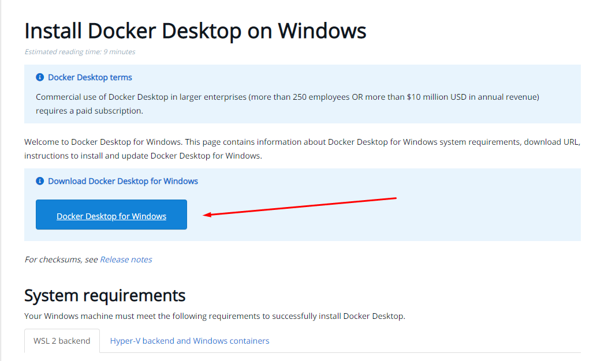
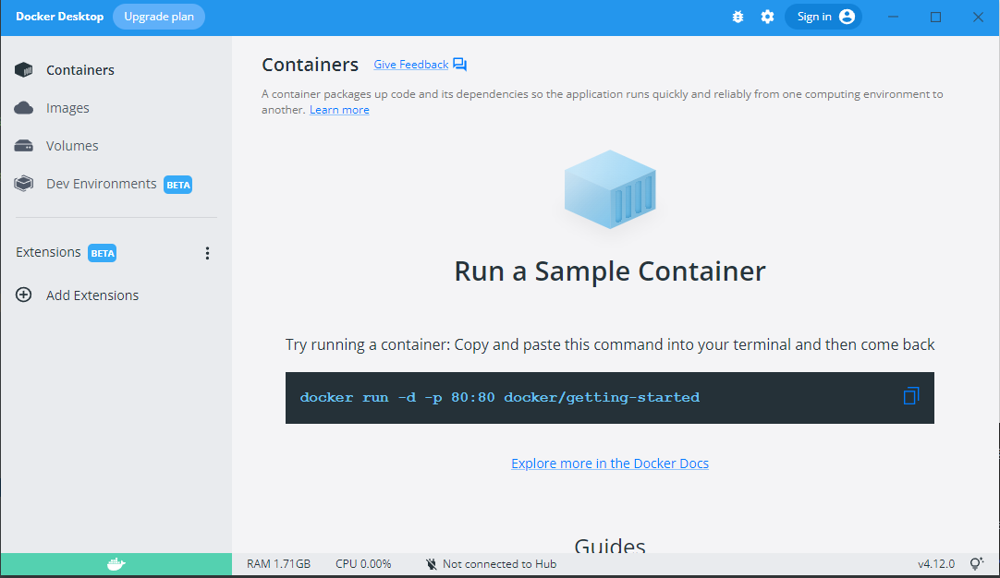
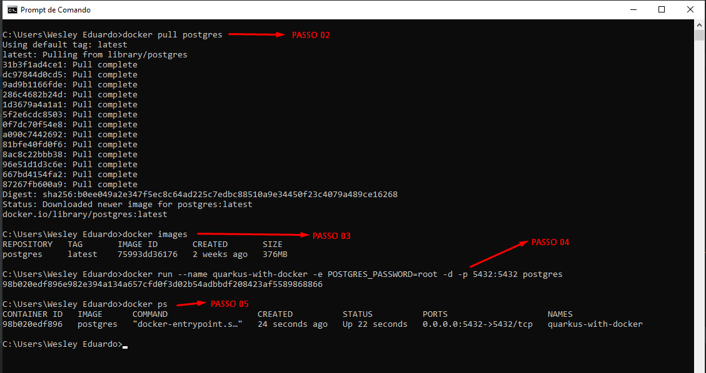
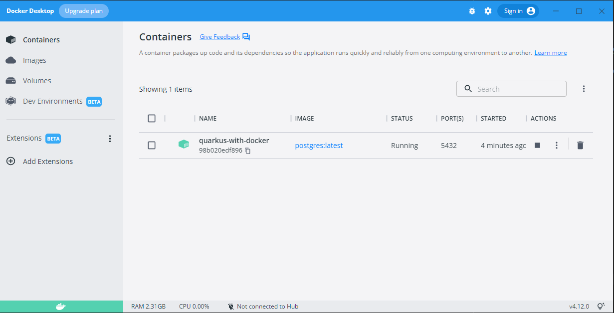
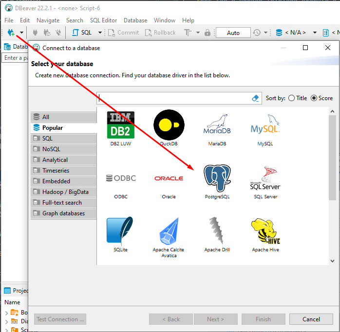
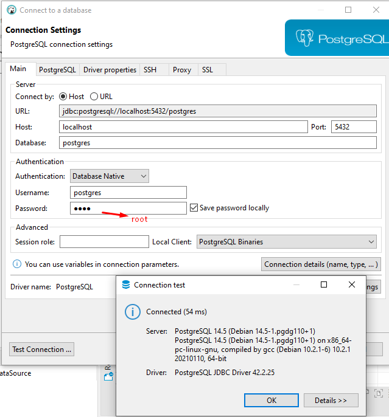
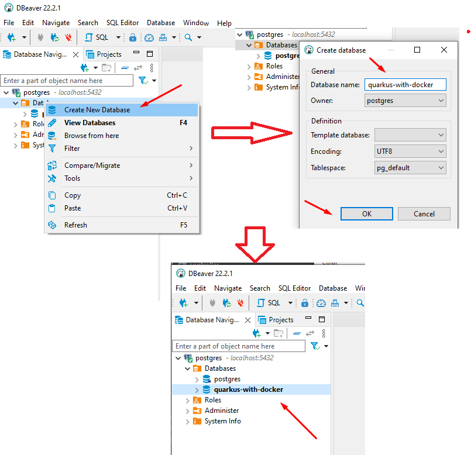
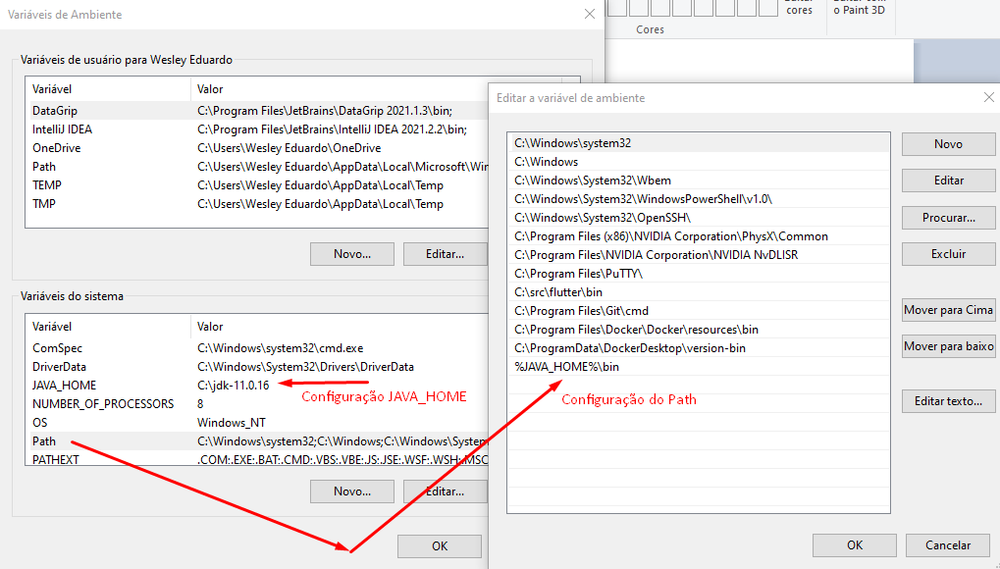
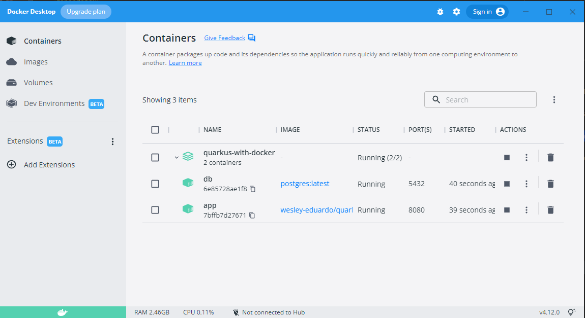
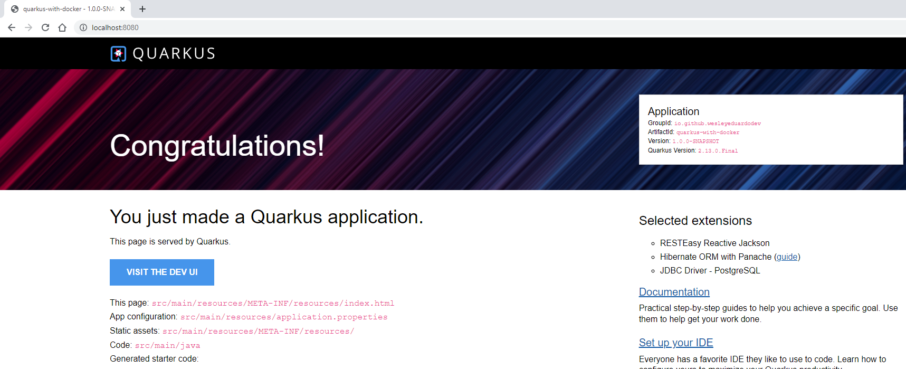

<h1 align="center">
  📦 Quarkus com Docker
</h1>

## 💻 Tecnologias

Esse projeto foi desenvolvido com as seguintes tecnologias:
* [Quarkus](https://code.quarkus.io/)
* [Docker](https://www.docker.com/)
* [Java](https://www.java.com/pt-BR/)
* [Apache Maven](https://maven.apache.org/)
* [HibernateORMPanache](https://quarkus.io/guides/hibernate-orm-panache)
* [Postgres](https://www.postgresql.org/)

---------------------------------------------------------------------------------------------------------------------------------------

INICIANDO A APLICAÇÃO VIA IDE E BANCO DE DADOS POSTGRES RODANDO EM DOCKER PARA WINDOWS:

OBS.: O objetivo desse projeto não é criar uma implementação seguindo todos níveis de maturidade do padrão REST, e por isso as classes que foram criadas não devem ser seguidas
como padrão de desenvolvimento: O foco do projeto é criar uma implementação simples para testar o framework Quarkus em conjunto com o Docker.

1 - Certifique-se que tenha o Docker instalado, configurado e executando na sua máquina conforme especificação: (https://docs.docker.com/desktop/install/windows-install)

2 - Após ter o Docker iniciado execute o seguinte comando que pode ser pelo cmd do windows: docker pull postgres (Esse comando irá baixar a imagem da última versão do postgres)

3 - Execute o seguinte comando para ver que de fato o a imagem foi baixada: docker images (Aqui deverá ser identificado os dados da imagem baixada, como id, tag e etc)

4 - Execute o seguinte comando para subir o container com o banco: docker run --name quarkus-with-docker -e POSTGRES_PASSWORD=root -d -p 5432:5432 postgres

5 - O comando anterior criou container com o nome quarkus-with-docker e um banco de dados padrão postgres. O usuário também é postgres e senha é root. O resultado pode ser vizualizado usando o seguinte comando: docker ps (O container pode ser vizualizado também na ferramento Docker para Desktop na parte de Containers)

6 - Utilize uma ferramenta para realizar a conexão e a criação de um novo banco com nome quarkus-with-docker. Recomendo o DBeaver como ferramenta gratuíta: https://dbeaver.io/download/

Passo 8: Subir a alicação pela sua IDE e testar o link (http://localhost:8080) no navegador:

-------------------------------------------------------------------------------------------------------------------------------------------------------------

SUBINDO A APLICAÇÃO E O BANCO DE DADOS COM DOCKER COMPOSE:

OBS 01: Umas das vantagens de usar o docker-compose é simplificar o processor de subir as imagens dos containers sem precisar lembrar dos comandos Docker. 
Além disso é possível containerizar de forma prática tudo que é preciso para subir uma aplicação.

OBS 02: Garanta que no arquivo do pom.xml do projeto que esteja trabalhando no contexto Quarkus tenha a dependência abaixo, pois os comandos precisam dessa dependência/biblioteca.

    <dependency>
        <groupId>io.quarkus</groupId>
        <artifactId>quarkus-container-image-docker</artifactId>
    </dependency>

1 - Ter o java 11 configurado nas variáveis de ambiente do sitema operacional (https://www.oracle.com/br/java/technologies/javase/jdk11-archive-downloads.html)

2 - Abrir o arquivo aplication.propertie e alterar a URL do banco de localhost para db ficando da seguinte forma: quarkus.datasource.jdbc.url=jdbc:postgresql://db:5432/quarkus-with-docker

3 - Executar o seguinte comando na pasta raiz do projeto através do terminal para criar uma rede interna: docker network create quarkus-with-docker (Serve para a aplicação e o banco usarem a mesma rede)

4 - Executar o seguinte comando na pasta raiz do projeto para gerar a imagem da aplicação: ./mvnw clean package -Dquarkus.container-image.build=true

5 - Execute o seguinte comando na pasta raiz do projeto para subir o Container com as imagens da aplicação e do banco: docker-compose up

CONSIDERAÇÕES:

1 - Observe que nas duas últimas imagens é possível vizualizar o Container que foi criada com as duas imagens (aplicação e banco).
Além disso não houve erros ao subir o Container, podendo ser testado o resultano no navegador pelo http://localhost:8080, visto que a porta configurada do arquivo docker-compose.yml para aplicação fois a 8080.

2 - Sempre ocorrem imprevisto né? Se algum desses passos não deram certo com você fale comigo por Email ou Whatsaap.

    Email: wesleyeduardo.dev@gmail.com
    WhatsApp: 98981650805

3 - Demais comandos Docker:

Baixar imagem da última versão do postgres: docker pull postgres

Baixar uma versão específica do postgres: docker pull postgres 12.2

Listar imagens: docker images

Rodar container e exportar a porta: docker run --name nome-banco -e POSTGRES_PASSWORD=mysecretpassword -d -p 5432:5432 postgres

Entrar no bash: docker exec -it ''id do container'' bash (Se der erro tentar pelo cmd)

Entrar no postgres: psql -U postgres

Criar base de dados: CREATE DATABASE nome-da-base;

Sair: \q

Deletar imagem pelo ID: docker rmi 'ID da imagem'

Listar container: docker ps (Listar containers)

Deletar container pela tag: docker rm -f 'tag-container'

OBS.: Para executar essas ações também pode ser usado o Docker Desktop, o que ajuda a não precisar lembrar desses comandos.

-------------------------------------------------------------------------------------------------------------------------------------------------------------

    
